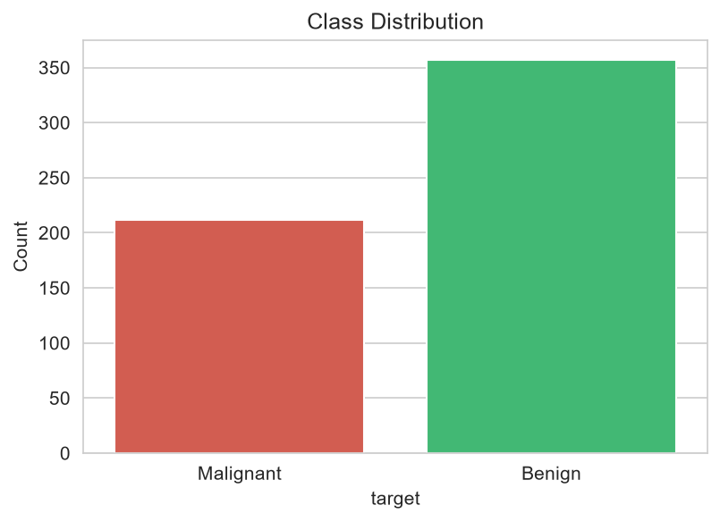
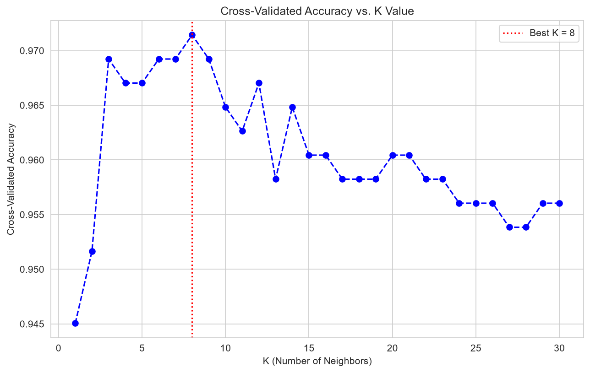
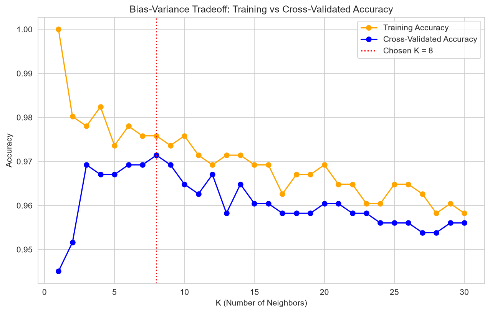
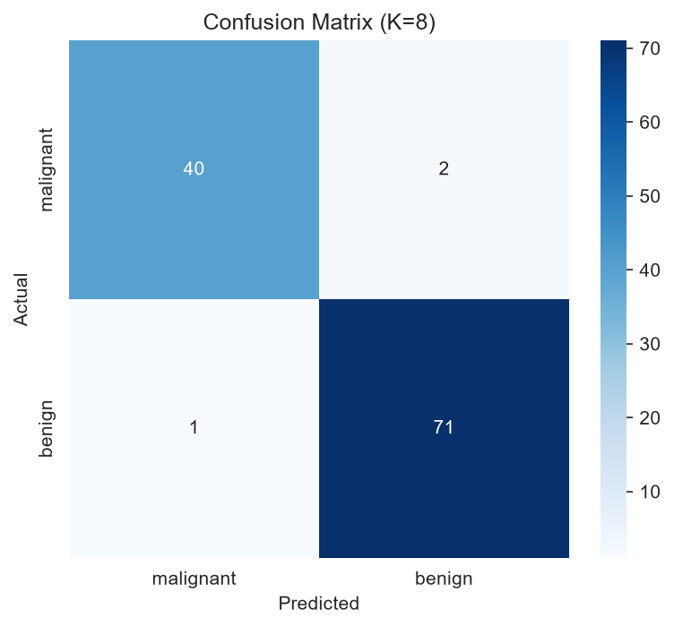
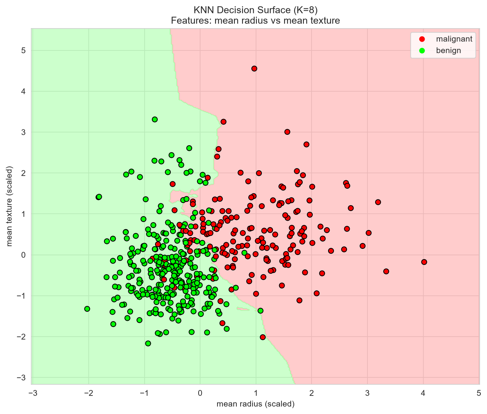
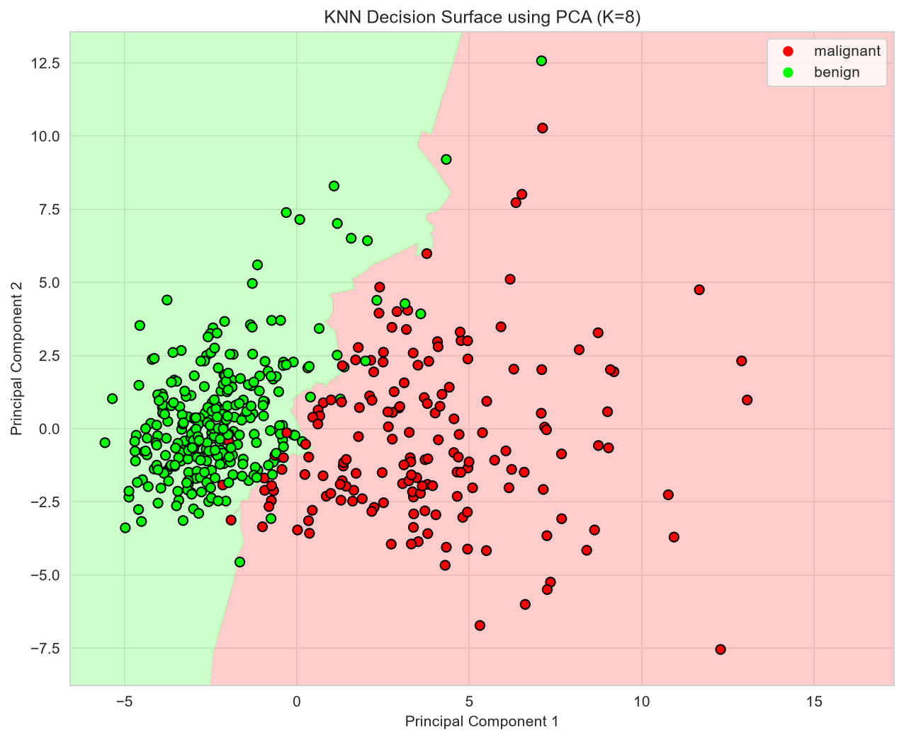

# 🔬 Breast Cancer Diagnosis using K-Nearest Neighbors (KNN)

A complete, real-world machine learning project that applies the **K-Nearest Neighbors (KNN)** algorithm to classify breast tumors as **Malignant (cancerous)** or **Benign (non-cancerous)**, using the Breast Cancer Wisconsin (Diagnostic) Dataset.

This project was built as a hands-on learning exercise covering the **entire KNN workflow** — from raw data to a deployable, evaluated, and saved model — with a strong focus on two commonly under-taught concepts: **cross-validation for hyperparameter tuning** and **decision surface visualization**.

---

## 📌 Table of Contents
- [Project Overview](#-project-overview)
- [Dataset](#-dataset)
- [Why KNN?](#-why-knn)
- [Project Workflow](#-project-workflow)
- [Tech Stack](#-tech-stack)
- [Project Structure](#-project-structure)
- [How to Run](#-how-to-run)
- [Results](#-results)
- [Key Visualizations](#-key-visualizations)
- [Overfitting / Underfitting Check](#-overfitting--underfitting-check)
- [Testing on Unseen Data](#-testing-on-unseen-data)
- [What I Learned](#-what-i-learned)
- [Future Improvements](#-future-improvements)

---

## 📖 Project Overview

Breast cancer diagnosis relies on measurements taken from digitized images of a breast mass's cell nuclei (radius, texture, perimeter, smoothness, etc.). This project builds a classifier that predicts whether a tumor is **malignant** or **benign** based on these measurements — using KNN, one of the simplest yet most instructive algorithms in machine learning.

The goal wasn't just to get a high accuracy score, but to deeply understand **how and why KNN works**, including:
- How distance-based classification behaves
- Why feature scaling is non-negotiable for KNN
- How to objectively choose the number of neighbors (K) instead of guessing
- How to detect and avoid overfitting/underfitting
- What the decision boundary actually looks like in feature space

---

## 📊 Dataset

**Breast Cancer Wisconsin (Diagnostic) Dataset** — a real-world dataset built into `scikit-learn`, originally collected at the University of Wisconsin Hospitals.

| Property | Value |
|---|---|
| Samples | 569 |
| Features | 30 numeric features (mean, standard error, and "worst" values of radius, texture, perimeter, area, smoothness, etc.) |
| Target Classes | Malignant (0), Benign (1) |
| Missing Values | None |
| Class Balance | ~63% Benign, ~37% Malignant |

---

## 🤔 Why KNN?

KNN is a **distance-based, instance-based (lazy) learning algorithm**. It doesn't build an explicit model during training — instead, it stores the training data and classifies a new point by looking at the majority class among its **K nearest neighbors** in feature space.

It's an excellent algorithm for building intuition around:
- Distance metrics
- Decision boundaries
- The bias-variance tradeoff (directly controlled by K)
- The importance of feature scaling

---

## 🔄 Project Workflow

1. **Exploratory Data Analysis (EDA)** — shape, missing values, class distribution, correlation heatmap
2. **Feature Scaling** — visual proof of why `StandardScaler` is essential for KNN
3. **Train-Test Split** — stratified split, scaler fit only on training data (no data leakage)
4. **Baseline Model** — KNN with default K=5 as a starting point
5. **Cross-Validation** — 5-fold CV across K=1 to 30 to find the optimal K objectively
6. **Final Model Training** — retrained using the best K found via CV
7. **Evaluation** — accuracy, confusion matrix, precision/recall/F1 classification report
8. **Overfitting/Underfitting Check** — train vs. test accuracy comparison, bias-variance tradeoff curve
9. **Unseen Data Test** — prediction on a completely new, synthetic patient sample
10. **Decision Surface Visualization** — both on 2 real features and on PCA-compressed features
11. **Model Persistence** — saved trained model + scaler using `joblib` for reuse

---

## 🛠️ Tech Stack

- **Python 3.11**
- **NumPy**, **Pandas** — data handling
- **Matplotlib**, **Seaborn** — visualization
- **scikit-learn** — KNN, cross-validation, StandardScaler, PCA, metrics
- **Jupyter Notebook** (run inside VS Code)
- **joblib** — model serialization

---

## 📁 Project Structure

```
knn-breast-cancer-diagnosis/
│
├── data/                          # (optional) raw/local data files
├── notebooks/
│   └── knn_project.ipynb          # main project notebook
├── images/                        # saved plots (EDA, K-selection, decision surfaces, etc.)
│   ├── knn_k_selection.png
│   ├── confusion_matrix.png
│   ├── bias_variance_tradeoff.png
│   ├── decision_surface_2features.png
│   └── decision_surface_pca.png
├── models/
│   ├── knn_breast_cancer_model.pkl
│   └── scaler.pkl
├── requirements.txt
├── README.md
└── .gitignore
```

---

## 🚀 How to Run

```bash
# Clone the repository
git clone <your-repo-link>
cd knn-breast-cancer-diagnosis

# Create and activate a virtual environment
python -m venv venv
venv\Scripts\activate        # Windows
# source venv/bin/activate   # Mac/Linux

# Install dependencies
pip install -r requirements.txt
```

Then open `notebooks/knn_project.ipynb` in VS Code (or Jupyter) and run all cells top to bottom.

**To use the saved model directly (without retraining):**

```python
import joblib
import numpy as np

model = joblib.load('models/knn_breast_cancer_model.pkl')
scaler = joblib.load('models/scaler.pkl')

new_data = np.array([[...]])  # 30 feature values, same order as the dataset
new_data_scaled = scaler.transform(new_data)
prediction = model.predict(new_data_scaled)
```

---

## 📈 Results

| Metric | Value |
|---|---|
| Optimal K (via 5-fold Cross-Validation) | **8** |
| Cross-Validated Accuracy | **97.14%** |
| Final Test Accuracy | **97.37%** |
| Train Accuracy | **97.58%** |
| Train-Test Accuracy Gap | **0.0021 (0.21%)** |

The very small gap between training and test accuracy (0.21%) confirms the model **generalizes well** and is neither overfitting nor underfitting.

### Classification Report (Test Set)

| Class | Precision | Recall | F1-Score | Support |
|---|---|---|---|---|
| Malignant | 0.98 | 0.95 | 0.96 | 42 |
| Benign | 0.97 | 0.99 | 0.98 | 72 |
| **Accuracy** | | | **0.97** | 114 |

**Note:** Recall for malignant cases (0.95) is especially important in this context — it means the model correctly identified 95% of actual cancer cases, minimizing dangerous false negatives.

---

## 🖼️ Key Visualizations
## 🖼️ Key Visualizations

### Class Distribution


### K-Selection Curve (Cross-Validation)


### Bias-Variance Tradeoff


### Confusion Matrix


### Decision Surface (2 Features)


### Decision Surface (PCA)


## ⚖️ Overfitting / Underfitting Check

Two checks were used to validate the model's generalization ability:

1. **Train vs. Test Accuracy Comparison** — a large gap would indicate overfitting; low accuracy on both would indicate underfitting. Here, training accuracy (97.58%) and test accuracy (97.37%) differ by only 0.21%, indicating strong generalization.
2. **Bias-Variance Tradeoff Curve** — plotting training accuracy alongside cross-validated accuracy across all tested K values shows the classic pattern:
   - **K=1** → near-perfect training accuracy, lower CV accuracy (overfitting, high variance)
   - **Very large K** → both training and CV accuracy drop and converge (underfitting, high bias)
   - **K=8 (chosen)** → sits near the peak of the cross-validated accuracy curve, balancing both

---

## 🧪 Testing on Unseen Data

To simulate real-world usage, the final trained model was tested on a **synthetic, completely unseen patient sample** — data that was never part of training, testing, or cross-validation. The model output both a predicted diagnosis and a confidence score (via `predict_proba`), mimicking how this model would actually be used in a clinical decision-support context. The reloaded, saved model (from the `.pkl` files) was also verified to produce an identical prediction, confirming the model is correctly persisted for reuse.

---

## 💡 What I Learned

- Why distance-based algorithms like KNN require feature scaling
- How to avoid data leakage by fitting the scaler only on training data
- How to objectively select a hyperparameter (K) using cross-validation instead of guessing
- How to diagnose overfitting and underfitting using train/test/CV accuracy comparisons
- How to visualize a model's decision boundary, and why dimensionality reduction (PCA) is needed to visualize high-dimensional decision surfaces
- How to persist a trained model and scaler for reuse in production-like settings

---

## 🔮 Future Improvements

- Try other distance metrics (Manhattan, Minkowski) and compare performance
- Handle class imbalance more explicitly (e.g., weighted KNN, SMOTE)
- Compare KNN against other classifiers (Logistic Regression, SVM, Random Forest)
- Deploy the model as a simple web app (Flask/Streamlit) for interactive predictions

---

## 📬 Contact

Feel free to connect or reach out if you have questions or feedback about this project.

**⭐ If you found this project useful, consider giving it a star on GitHub!**
